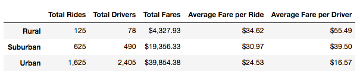
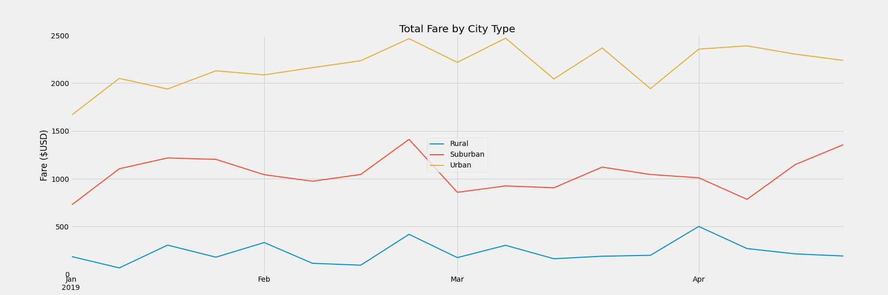

# PyBer_Analysis

## Analysis Overview
To analyze Pyber's ride sharing and driver data for 3 city types - Urban, Suburban and Rural, and plot a multiple line graph to depict the average fare for each month for each city type to understand which months of the analysis period the fare was at its highest and lowest

## Results
### Data Summary

- As seen from the analysis summary DataFrame above, the total number of rides taken in Urban cities is twice that of the combined total of Rural and Suburban cities while having nearly 5 times the driver count. The average fare per ride, and per driver is highest for Rural, then Suburban and least for Urban cities. However, the total fares for Urban cities is significantly higher than that of Suburban and Rural cities

- It can also be seen that the total number of rides for urban cities is 2/3rds of the total number of drivers, indicating that the supply of drivers is disproportionately higher than the number of rides. Whereas, the number of rides for rural and suburban cities is higher than the number of available drivers indicating that the demand for rides exceeds the supply of drivers in these city types

### Fares by City Type Summary

- As seen from the line chart above, it can be inferred that the fares for all 3 city types are high at the beginning of the last week of February, and drop during the last week of February, with the Suburban cities having an especially sharp decrease in fares. 

- Rural and Suburban cities have a relatively steady fare throughout March, but Urban cities have a weekly rise and fall during this month.

- There is also a steady increase in fares for Urban cities till the last week of February, and the fares go through weekly peaks and troughs since then through the end of March, after which they remain at a relatively high and steady state (~$2,300)

## Summary and Recommendations
- Based on the analysis and findings, with the total number of drivers in urban cities significantly higher than rural and suburban cities, Pyber can look into re-deploying some drivers from the urban cities into the rural and suburban cities to meet the demand for rides.

- Based on these findings, PyBer can redeploy the surplus of drivers from urban cities to suburban and rural cities, and look to get the ratio of total drivers to total rides closer to 1 (allowing for some drivers contingency across all city types to accommodate for sudden spikes in demand due to events/unforeseen circumstances). 

- March was the busiest month in terms of total number of rides taken, so having an optimal driver deployment strategy across the 3 city types can help PyBer maximize revenue from rides during this period

